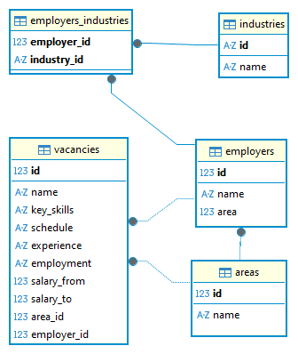

# 📊 Project 2: HeadHunter Vacancies Analysis

This project is part of the **SkillFactory Data Science course** and is dedicated to analyzing vacancies in the Data Science field from the HeadHunter website.  
The repository includes SQL queries, data processing in Python, and environment setup for reproducibility of results.

---
## 🧠 SQL Diagnostics

The project uses Metabase to analyze the SkillFactory public database. The main SQL queries include:

- **Counting vacancies by industry**: Identifies the most actively hiring sectors  
- **Employer salary comparison**: Shows average salaries at leading companies  
- **Skill co-occurrence networks**: Detects clusters of frequently combined skills  
- **Employer-to-vacancy ratio**: Evaluates the level of competition in each industry  

All queries are documented and linked to visual graphs.

---
## 📁 Project Structure

- **Python_and_SQL.ipynb** — main notebook with SQL queries executed via Python  
- **PROJECT_2_Анализ_вакансий_из_HeadHunter.ipynb** — test notebook    
- **Python_and_SQL_Commented.ipynb** — draft commented version of SQL logic  
- **SQL_uppercase_diff.txt** — SQL query formatting comparison created by Copilot  
- **environment.yml** — Conda environment file for reproducibility  

---
## 📁 Project Folder Structure

├── environment.yml         # Conda environment definition  
├── README.md               # Project overview and instructions  
├── plots/                  # All generated visualizations  
├── sql/                    # Saved SQL queries  
├── notebooks/              # Jupyter notebooks for analysis  
└── data/                   # Raw and processed datasets  

---
### ERD Schema: Vacancies Database Structure



The diagram shows the structure and relationships between key entities in the database related to vacancies, employers, industries, and regions.

#### Main Tables:

- **industries** — contains a list of industries, each with a unique `id`.  
- **employers** — employers table, includes `name` and `area`.  
- **areas** — directory of geographic regions (`name`).  
- **vacancies** — main vacancies table, includes:  
  - Vacancy title (`name`)  
  - Key skills (`key_skills`)  
  - Work schedule, experience, employment type  
  - Salary boundaries (`salary_from`, `salary_to`)  
  - Link to employer (`employer_id`) and region (`area_id`)  
- **employers_industries** — links employers with industries through `employer_id` and `industry_id`.  

#### Table Relationships:

- `vacancies` linked to `employers` by `employer_id`.  
- `vacancies` linked to `areas` by `area_id`.  
- `employers_industries` links `employers` and `industries`, allowing one employer to work in several industries.  

#### Purpose of the Schema:

- Provides flexibility for analyzing vacancies by industry and region.  
- Enables queries for competition, salary, and employer distribution analysis.  
- Simplifies visualization of relationships and building analytical models.  

---
## 🧪 Environment Setup

The project uses a **Conda environment** named `Conda_SkillsFactory`.  
It includes the necessary libraries for data analysis, PostgreSQL integration, and visualization.  

Create environment:

```bash
conda env create -f environment.yml
```

Activate environment:

```bash
conda activate Conda_SkillsFactory
```

---
## 📦 Key Packages

Below are the key packages listed in `environment.yml`:  

- **Numerical computing**: numpy, scipy, bottleneck, numexpr, mkl  
- **Data processing**: pandas  
- **Visualization**: matplotlib-base, contourpy, cycler, fonttools  
- **Utilities**: setuptools, wheel, six, typing-extensions, sortedcontainers, xmltodict  
- **System libraries and compression**: bzip2, brotli-python, zlib  

The full package list is available in the [`environment.yml`](./environment.yml).  
Channels used: `anaconda` and `defaults`.

---
## 🚀 Getting Started

1. Clone the repository or download project files.  
2. Set up the Conda environment as described above.  
3. Open the main notebook and follow the analysis steps.  

---
## ✨ Key Features

- SQL filtering and aggregation of vacancies  
- Python logic for salary normalization and skill counting  
- Reproducible environment via Conda (`environment.yml`)  
- Detailed comments and SQL queries formatted in uppercase for readability  
- Integration with VS Code Copilot Agent for simplified editing and annotation  

---
## 🛠 Development Notes

- Environment exported using:  

  ```bash
  conda env export > environment.yml
  ```

- Compatible with **Python 3.13**  
- Tested in `Conda_SkillsFactory` environment  
- Data sources — simulated or exported from HeadHunter via SQL queries  

---
## 📊 Visualizations

All generated charts are stored in the `plots/` folder. Main examples:

- `industry_vacancy_comparison.png`: Top industries by number of vacancies  
- `employer_salary_comparison.png`: Average salary at leading employers in each industry  
- `skill_clusters_graph.png`: Skill cluster graph with Russian comments  
- `competition_ratio_plot.png`: Employer-to-vacancy ratio by industry  
- `salary_by_major_industry_employers.png`: Salary by top-3 employers in each industry  

Each chart is annotated and supports onboarding with localized Russian comments.

---
## 📬 Feedback

For questions, suggestions, or improvements, create an **Issue** or contact the project author.  
